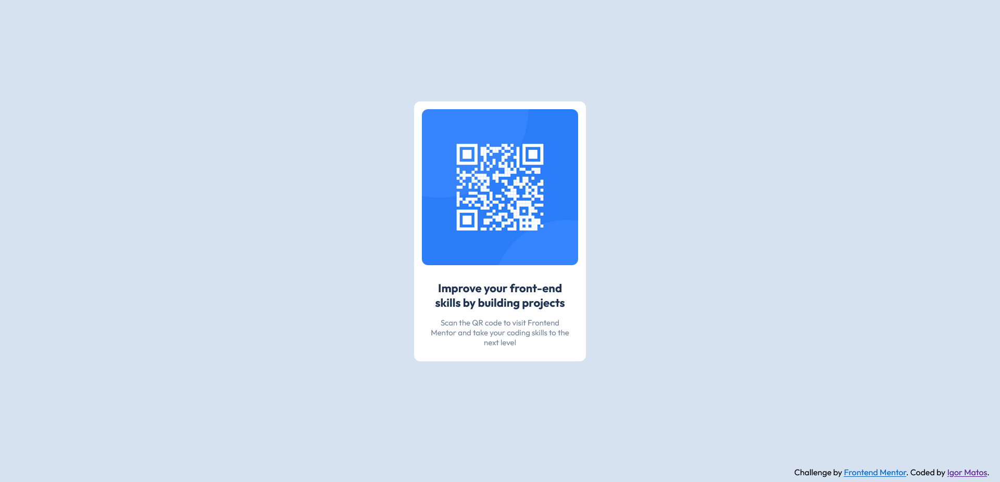

### Links

- Solution URL: [https://github.com/IgorWMatos/frontend_mentor01]
- Live Site URL: [Add live site URL here]

### Built with

- Semantic HTML5 markup
- CSS custom properties
- Flexbox

### What I learned

I've got to practice more of scss and translation tools from scss to css.

### Continued development

I plan to advance in my projects, start coding with grid, and implement features such as animations.

## Author

- Website - [Igor Matos](https://github.com/IgorWMatos)
- Frontend Mentor - [@IgorWMatos](https://www.frontendmentor.io/profile/IgorWMatos)